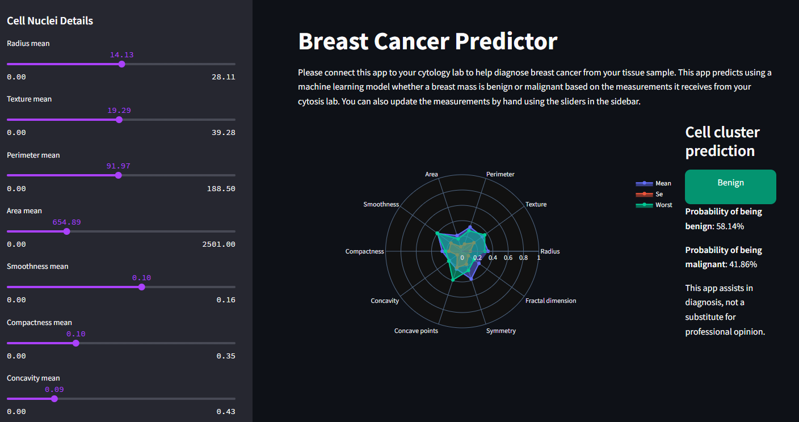

Web application built with Streamlit for predicting breast cancer using the Breast Cancer Wisconsin (Diagnostic) Data Set. The app leverages machine learning models to classify whether a tumor is benign or malignant.

This app uses a machine learning model to predict whether a breast tumor is benign or malignant. Users can manually adjust cell nucleus values or connect the app to a cytology lab for precise predictions.

