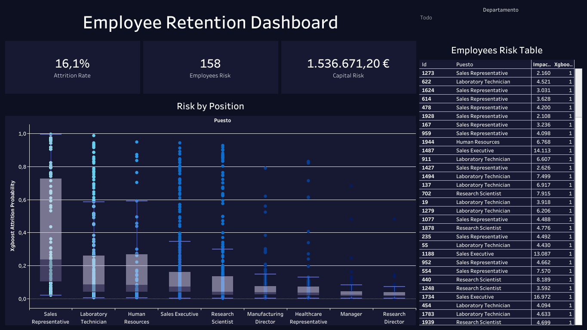

In today’s competitive job market, understanding employee attrition is crucial for organizations aiming to enhance retention strategies and reduce turnover costs. My Employee Attrition Analysis project utilizes advanced data analytics and machine learning techniques to provide actionable insights into employee behavior and attrition rates.



#### Project Highlights
- Comprehensive Data Cleaning: Leveraged Python to efficiently load and preprocess the Employee_Attrition.csv dataset, addressing missing values and irrelevant columns to ensure data integrity.

- In-Depth Exploratory Data Analysis (EDA): Created dynamic visualizations using libraries such as Seaborn and Matplotlib to explore the distributions of categorical and numerical variables. Conducted a thorough correlation analysis to identify relationships between key factors and attrition rates.

- Predictive Modeling with Machine Learning: Developed and trained multiple machine learning models, including Decision Trees, Random Forests, XGBoost, and Logistic Regression. Evaluated model performance using critical metrics such as ROC AUC, accuracy, recall, F1 Score, and confusion matrices to identify the most effective strategies for predicting employee turnover.

- Economic Impact Assessment: Estimated the financial implications of attrition across various salary levels and engagement metrics. Analyzed potential savings by projecting the effects of reducing turnover by 10%, 20%, and 30%, thus demonstrating the economic value of implementing effective retention strategies.

### Interactive Dashboard
To visualize the findings and key insights, I created an interactive dashboard using Tableau. This dashboard offers an intuitive way to explore the data and results. You can view it here.

### Technical Skills and Tools
- Programming Languages: Python
- Data Analysis Libraries: NumPy, Pandas, Scikit-learn
- Visualization Tools: Seaborn, Matplotlib, Tableau
- Machine Learning Techniques: Decision Trees, Random Forest, XGBoost, Logistic Regression

### Getting Started
To explore the code and analysis:

1. Clone the repository:

```bash
git clone https://github.com/username/employee-retention.git
```

2. Install the required dependencies:

```bash
pip install -r requirements.txt
```
3. Run the main analysis script:

```bash
python main.py
```
### Why This Project Matters
By analyzing employee attrition, organizations can enhance their talent management strategies, reduce operational costs, and foster a more engaged workforce. This project showcases my ability to apply data science techniques to solve real-world problems, making me a valuable asset for any organization focused on optimizing their workforce.