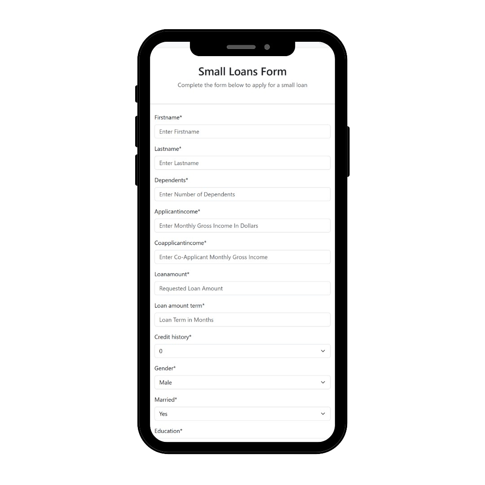

## Project Overview

The **ML Bank Loan Approval API** is a robust RESTful service built with **Django** and **Django REST Framework** that leverages machine learning algorithms to automate the loan approval process. This project exemplifies my ability to integrate **data science** and **web development**, providing a seamless user experience while delivering insightful predictions based on user input.

## Technical Highlights

- **Frameworks & Languages**: Developed using **Python** (version 3.8) and **Django 5.1.1**, ensuring a scalable and maintainable architecture.
- **Machine Learning Integration**: Utilized machine learning models to predict loan approvals based on historical data. The model was trained using features such as applicant income, loan amount, and credit history.
- **API Development**: Implemented RESTful API endpoints for user interactions, employing Django REST Framework to handle CRUD operations efficiently.
- **Database Management**: Configured the application to use PostgreSQL through `dj_database_url`, ensuring seamless database connectivity and management.
- **Environment Management**: Utilized a virtual environment with `requirements.txt` for dependency management, making the project easily deployable and reproducible.
- **Deployment**: Deployed the application on **Railway**, demonstrating skills in cloud infrastructure and continuous integration/deployment (CI/CD) practices.
- **Input Validation**: Incorporated validation checks to ensure data integrity and enhance the reliability of the predictions.

## Key Features

- **User Interface**: A clean, user-friendly interface that allows applicants to submit their details effortlessly.
- **Data Validation**: Robust validation mechanisms to prevent erroneous data submissions, improving overall user experience.
- **Predictive Analytics**: Real-time predictions for loan approval status, offering users immediate feedback on their applications.
- **Responsive Design**: Ensured the application is fully responsive, providing a consistent experience across different devices.

## Learning Outcomes

This project enhanced my skills in:

- Building RESTful APIs using Django and Django REST Framework.
- Integrating machine learning models into web applications.
- Managing database connections and migrations effectively.
- Deploying applications to cloud services and configuring environment variables for security.
- Creating user-friendly interfaces with a focus on usability and accessibility.

## Technologies Used

- **Backend**: Django, Django REST Framework, Python
- **Database**: PostgreSQL
- **Machine Learning**: Scikit-learn, Pandas
- **Deployment**: Railway, Git
- **Version Control**: Git, GitHub

## Keywords

- Django
- RESTful API
- Machine Learning
- PostgreSQL
- Data Validation
- Deployment
- Cloud Infrastructure
- Predictive Analytics

## Conclusion

The **ML Bank Loan Approval API** is a testament to my capabilities in both web development and data science, showcasing my ability to deliver end-to-end solutions that leverage technology to solve real-world problems. I am eager to apply these skills in a professional setting, contributing to innovative projects that make a difference.
